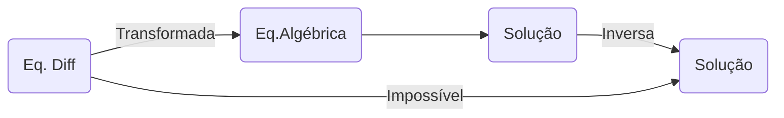

Tags: [[Cálculo_Análise]]
Referências: Notas do prof. Zé Paulo

---
Base: Olhar tabela e comparar

Def:
$$
\mathcal{L}\{f(t)\} = \int_{0}^{\infty} e^{-st} f(t) dt = F(s)
$$

---
# 1   Transformada de derivadas
$$\begin{aligned}
\mathcal{L}\{f'(t)\} &= sF-f(0) \\
\mathcal{L}\{f''(t)\} &= s^2F-sf(0)-f'(0)\\
\mathcal{L}\{f^{n}(t)\} &= s^{n}F - \sum\limits_{k=1}^{n}s^{n-1}f^{n-k}(0) 
\end{aligned}$$

---
# 2   Transformada de Integrais
$$
\frac{1}{s}f(s) = \mathcal{L}\left\{\int_{0}^{t}F(x)dx\right\}; f(s)=\mathcal{L}\{F(x)\}
$$
---
# 3   Teorema da Translação
Em s:
$$
\mathcal{L}\{ e^{at}f(t)\} = F(s-a)
$$
Em t:
$$
\mathcal{L}\{f(t-b)\} = e^{-bs}F(s), \forall t \geq b
$$
---
# 4   Teorema da convolução
Define-se convolução como:
$$
f \ast g = \int_{0}^{t} f(\xi)g(t-\xi)d\xi
$$
as transformadas de Laplace:
$$
\mathcal{L}\{f\ast g\} = \mathcal{L}\{f\}\mathcal{L}\{g\}
$$
---
# 5   Derivada da Transformada
$$
\mathcal{L}\{tf(t)\} = -F'(s)
$$
---
# 6   Bônus: Tabela
Link: [Tabela de Transformadas](https://drive.google.com/file/d/17HndRAvVTiVQ7xPo2ocqM1Z6ZtbpjPQM/view?usp=drive_link)
![[Tabela de Transformações de Laplace.pdf]]
